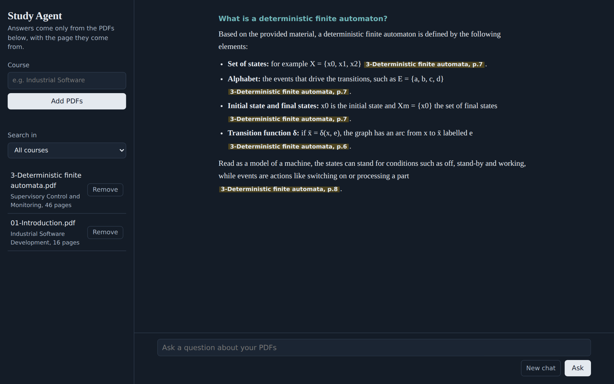
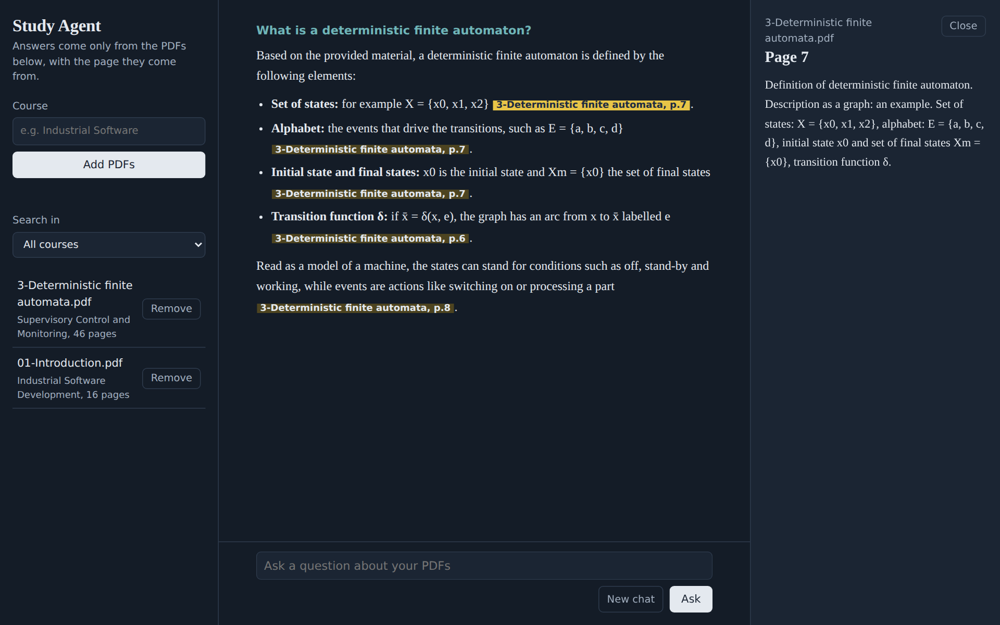

# CyberAI Study Agent

An [Anna](https://anna.partners) app that answers questions about your course PDFs, citing the file and page each claim comes from.

## What it does

- Add the PDFs of your courses (slides, notes, papers) and optionally tag each one with a course.
- Ask questions in any language. Answers are built only from your material and every claim cites `[file, p.N]`.
- Select a citation to read the exact passage it comes from.
- If your material does not cover the question, the app says so instead of guessing.

## How it works

The app has two parts:

- **The window** (`bundle/`) handles the conversation and calls the AI models provided by Anna for embeddings and answers.
- **A small local backend** (`executas/cyberai-study-agent/`) runs in your Anna agent environment. It extracts the text of each PDF with `pypdf`, splits it into passages, stores them with their embeddings in a local index and finds the passages most relevant to each question.

It is a port of the [cyberai-study-agent](https://github.com/DavideDeplano/cyberai-study-agent) RAG project to Anna AI OS.

## Support

Found a bug or have a request? [Open an issue](https://github.com/DavideDeplano/cyberai-study-agent-anna/issues).

## Privacy

- **Your PDFs** are read by the app's backend inside your own Anna agent environment. The files themselves are not uploaded anywhere else.
- **The index** (passage text and embeddings) is stored in a single file, `~/.cyberai-study-agent-anna/index.json`, in that same environment. **Remove** in the app deletes a PDF's passages from it.
- **Sent to the AI models:** to search and answer, the text of your passages and your questions are sent to the AI models provided by Anna, under [Anna's own terms](https://anna.partners).
- **Nothing is collected by the developer.** The app has no analytics, no tracking and no server of its own.

## Licence

MIT. See [LICENSE](LICENSE).
